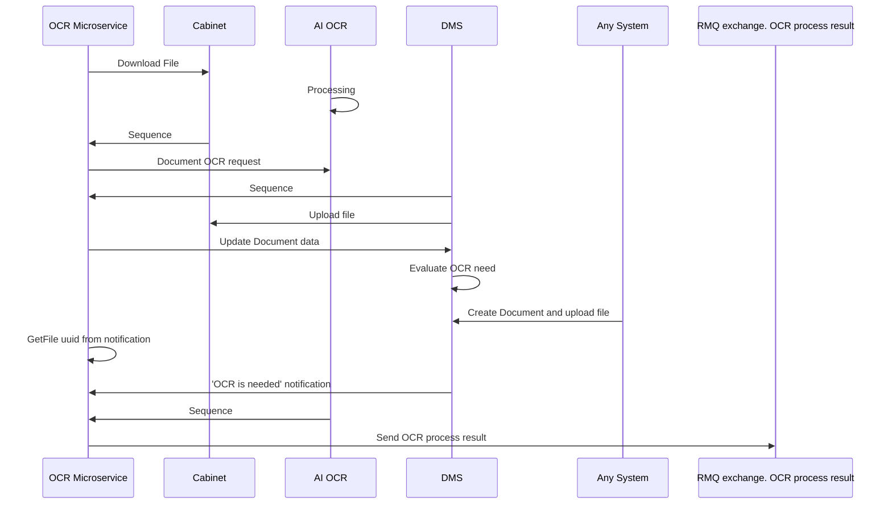

# CBL-23440 Unstructured Income Statement Document OCR Reading

```mermaid
sequenceDiagram
    participant OCR_Microservice as OCR Microservice
    participant Cabinet as Cabinet
    participant AI_OCR as AI OCR
    participant DMS as DMS
    participant Any_System as Any System
    participant RMQ_exchange_OCR_process_result as RMQ exchange. OCR process result
    OCR_Microservice->>Cabinet: Download File
    AI_OCR->>AI_OCR: Processing
    Cabinet->>OCR_Microservice: Sequence
    OCR_Microservice->>AI_OCR: Document OCR request
    DMS->>OCR_Microservice: Sequence
    DMS->>Cabinet: Upload file
    OCR_Microservice->>DMS: Update Document data
    DMS->>DMS: Evaluate OCR need
    Any_System->>DMS: Create Document and upload file
    OCR_Microservice->>OCR_Microservice: GetFile uuid from notification
    DMS->>OCR_Microservice: 'OCR is needed' notification
    AI_OCR->>OCR_Microservice: Sequence
    OCR_Microservice->>RMQ_exchange_OCR_process_result: Send OCR process result
```
