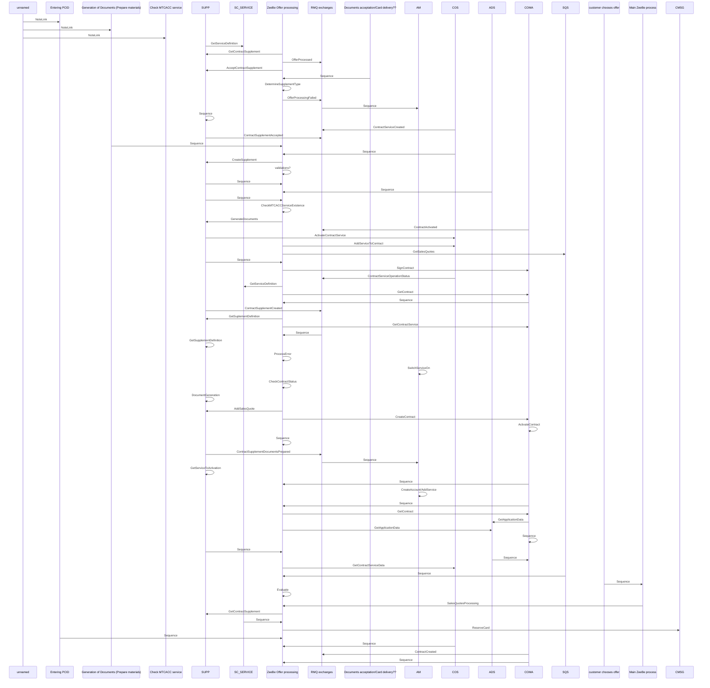

# SME Contract Supplement offer processing

```mermaid
sequenceDiagram
    participant unnamed as unnamed
    participant Entering_PCID as Entering PCID
    participant unnamed as unnamed
    participant Generation_of_Documents_Prepare_materials as Generation of Documents (Prepare materials)
    participant unnamed as unnamed
    participant Check_MTCACC_service as Check MTCACC service
    participant SUPP as SUPP
    participant SC_SERVICE as SC_SERVICE
    participant ZeeBe_Offer_processing as ZeeBe Offer processing
    participant RMQ_exchanges as RMQ exchanges
    participant Documents_acceptation_Card_delivery as Documents acceptation/Card delivery??
    participant AM as AM
    participant COS as COS
    participant ADS as ADS
    participant COMA as COMA
    participant SQS as SQS
    participant customer_chooses_offer as customer chooses offer
    participant Main_ZeeBe_process as Main ZeeBe process
    participant CMSG as CMSG
    unnamed->>Entering_PCID: NoteLink
    unnamed->>Generation_of_Documents_Prepare_materials: NoteLink
    unnamed->>Check_MTCACC_service: NoteLink
    SUPP->>SC_SERVICE: GetServiceDefinition
    ZeeBe_Offer_processing->>SUPP: GetContractSupplement
    ZeeBe_Offer_processing->>RMQ_exchanges: OfferProcessed
    ZeeBe_Offer_processing->>SUPP: AcceptContractSupplement
    Documents_acceptation_Card_delivery->>ZeeBe_Offer_processing: Sequence
    ZeeBe_Offer_processing->>ZeeBe_Offer_processing: DetermineSupplementType
    ZeeBe_Offer_processing->>RMQ_exchanges: OfferProcessingFailed
    RMQ_exchanges->>AM: Sequence
    SUPP->>SUPP: Sequence
    COS->>RMQ_exchanges: ContractServiceCreated
    SUPP->>RMQ_exchanges: ContractSupplementAccepted
    Generation_of_Documents_Prepare_materials->>ZeeBe_Offer_processing: Sequence
    COS->>ZeeBe_Offer_processing: Sequence
    ZeeBe_Offer_processing->>SUPP: CreateSupplement
    ZeeBe_Offer_processing->>ZeeBe_Offer_processing: validations?
    SUPP->>ZeeBe_Offer_processing: Sequence
    ADS->>ZeeBe_Offer_processing: Sequence
    SUPP->>ZeeBe_Offer_processing: Sequence
    ZeeBe_Offer_processing->>ZeeBe_Offer_processing: CheckMTCACCServiceExistence
    ZeeBe_Offer_processing->>SUPP: GenerateDocuments
    COMA->>RMQ_exchanges: ContractActivated
    SUPP->>COS: ActivateContractService
    ZeeBe_Offer_processing->>COS: AddServiceToContract
    ZeeBe_Offer_processing->>SQS: GetSalesQuotes
    SUPP->>ZeeBe_Offer_processing: Sequence
    ZeeBe_Offer_processing->>COMA: SignContract
    COS->>RMQ_exchanges: ContractServiceOperationStatus
    ZeeBe_Offer_processing->>SC_SERVICE: GetServiceDefinition
    ZeeBe_Offer_processing->>COMA: GetContract
    COMA->>ZeeBe_Offer_processing: Sequence
    SUPP->>RMQ_exchanges: ContractSupplementCreated
    ZeeBe_Offer_processing->>SUPP: GetSuplementDefinition
    ZeeBe_Offer_processing->>COMA: GetContractService
    RMQ_exchanges->>ZeeBe_Offer_processing: Sequence
    SUPP->>SUPP: GetSupplementDefinition
    ZeeBe_Offer_processing->>ZeeBe_Offer_processing: ProcessError
    AM->>AM: SwitchServiceOn
    ZeeBe_Offer_processing->>ZeeBe_Offer_processing: CheckContractStatus
    SUPP->>SUPP: DocumentGeneration
    ZeeBe_Offer_processing->>SUPP: AddSalesQuote
    ZeeBe_Offer_processing->>COMA: CreateContract
    COMA->>COMA: ActivateContract
    ZeeBe_Offer_processing->>ZeeBe_Offer_processing: Sequence
    SUPP->>RMQ_exchanges: ContractSupplementDocumentsPrepared
    RMQ_exchanges->>AM: Sequence
    SUPP->>SUPP: GetServiceToActivation
    COMA->>ZeeBe_Offer_processing: Sequence
    AM->>AM: CreateAccount/AddService
    COMA->>ZeeBe_Offer_processing: Sequence
    ZeeBe_Offer_processing->>COMA: GetContract
    COMA->>ADS: GetApplicationData
    ZeeBe_Offer_processing->>ADS: GetApplicationData
    COMA->>COMA: Sequence
    SUPP->>ZeeBe_Offer_processing: Sequence
    ADS->>COMA: Sequence
    ZeeBe_Offer_processing->>COS: GetContractServiceData
    SQS->>ZeeBe_Offer_processing: Sequence
    customer_chooses_offer->>Main_ZeeBe_process: Sequence
    ZeeBe_Offer_processing->>ZeeBe_Offer_processing: Evaluate
    Main_ZeeBe_process->>ZeeBe_Offer_processing: SalesQuotesProcessing
    ZeeBe_Offer_processing->>SUPP: GetContractSupplement
    SC_SERVICE->>ZeeBe_Offer_processing: Sequence
    ZeeBe_Offer_processing->>CMSG: ReserveCard
    Entering_PCID->>ZeeBe_Offer_processing: Sequence
    COS->>ZeeBe_Offer_processing: Sequence
    COMA->>RMQ_exchanges: ContractCreated
    COMA->>ZeeBe_Offer_processing: Sequence
```
