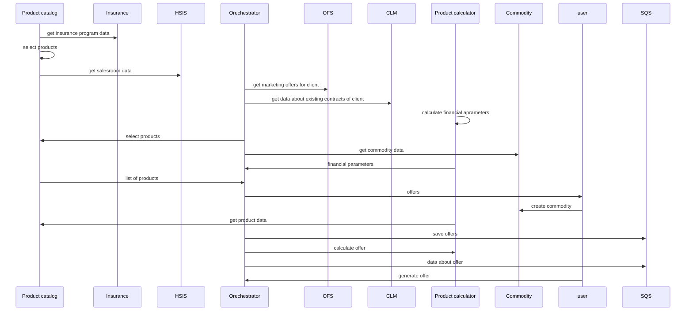

# Product calculator

```mermaid
sequenceDiagram
    participant Product_catalog as Product catalog
    participant Insurance as Insurance
    participant HSIS as HSIS
    participant Orechestrator as Orechestrator
    participant OFS as OFS
    participant CLM as CLM
    participant Product_calculator as Product calculator
    participant Commodity as Commodity
    participant user as user
    participant SQS as SQS
    Product_catalog->>Insurance: get insurance program data
    Product_catalog->>Product_catalog: select products
    Product_catalog->>HSIS: get salesroom data
    Orechestrator->>OFS: get marketing offers for client
    Orechestrator->>CLM: get data about existing contracts of client
    Product_calculator->>Product_calculator: calculate financial aprameters
    Orechestrator->>Product_catalog: select products
    Orechestrator->>Commodity: get commodity data
    Product_calculator->>Orechestrator: financial parameters
    Product_catalog->>Orechestrator: list of products
    Orechestrator->>user: offers
    user->>Commodity: create commodity
    Product_calculator->>Product_catalog: get product data
    Orechestrator->>SQS: save offers
    Orechestrator->>Product_calculator: calculate offer
    Orechestrator->>SQS: data about offer
    user->>Orechestrator: generate offer
```
