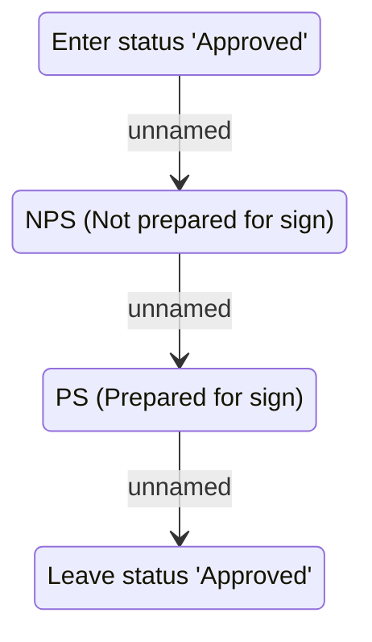

# Approved (S)

- **Diagram Type**: Statechart
- **Package**: HomerSelect/BSL/Analysis Model/Contract Management/COMMON for Contract Management/Loan Statechart Model
- **Diagram ID**: 141203
- **Elements**: 4
- **Connectors**: 3

