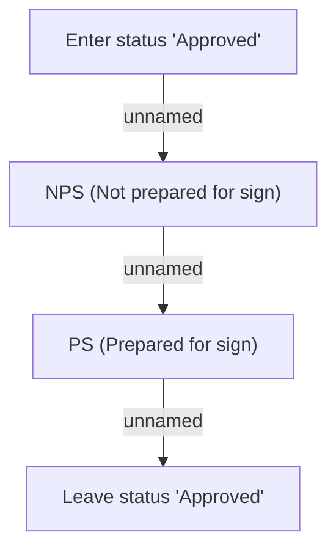

# Approved (S)

```mermaid
graph TD
    PS_Prepared_for_sign["PS (Prepared for sign)"]
    NPS_Not_prepared_for_sign["NPS (Not prepared for sign)"]
    Leave_status_Approved["Leave status 'Approved'"]
    Enter_status_Approved["Enter status 'Approved'"]
    PS_Prepared_for_sign -->|unnamed| Leave_status_Approved
    Enter_status_Approved -->|unnamed| NPS_Not_prepared_for_sign
    NPS_Not_prepared_for_sign -->|unnamed| PS_Prepared_for_sign
```
