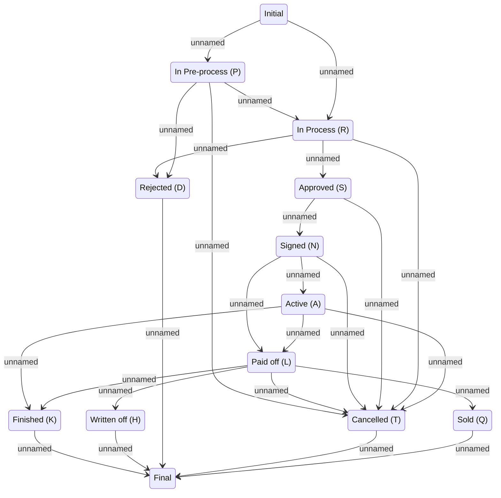

# Contract Statechart Model

- **Diagram Type**: Statechart
- **Package**: HomerSelect/BSL/Analysis Model/Contract Management/COMMON for Contract Management/Loan Statechart Model
- **Diagram ID**: 141200
- **Elements**: 13
- **Connectors**: 25

