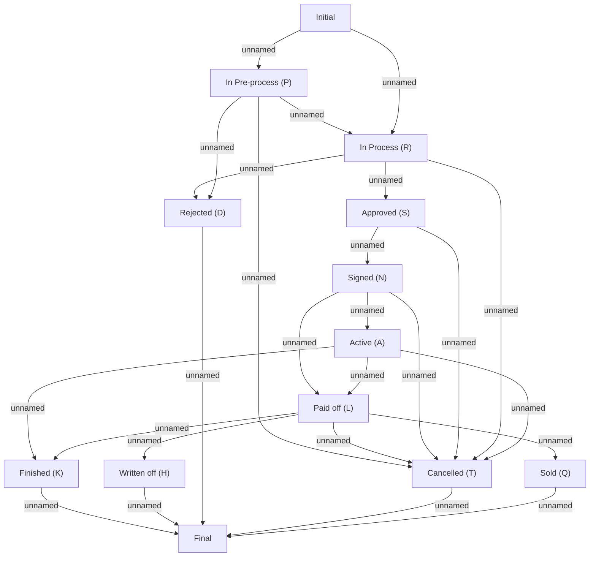

# Contract Statechart Model

```mermaid
graph TD
    Sold_Q["Sold (Q)"]
    In_Pre_process_P["In Pre-process (P)"]
    Final["Final"]
    Finished_K["Finished (K)"]
    Written_off_H["Written off (H)"]
    Paid_off_L["Paid off (L)"]
    Active_A["Active (A)"]
    Signed_N["Signed (N)"]
    Cancelled_T["Cancelled (T)"]
    Rejected_D["Rejected (D)"]
    Approved_S["Approved (S)"]
    Initial["Initial"]
    In_Process_R["In Process (R)"]
    Approved_S -->|unnamed| Signed_N
    Initial -->|unnamed| In_Pre_process_P
    Finished_K -->|unnamed| Final
    Written_off_H -->|unnamed| Final
    Rejected_D -->|unnamed| Final
    Cancelled_T -->|unnamed| Final
    Sold_Q -->|unnamed| Final
    Active_A -->|unnamed| Finished_K
    Paid_off_L -->|unnamed| Finished_K
    Paid_off_L -->|unnamed| Written_off_H
    Signed_N -->|unnamed| Paid_off_L
    Paid_off_L -->|unnamed| Sold_Q
    Signed_N -->|unnamed| Active_A
    In_Pre_process_P -->|unnamed| In_Process_R
    In_Pre_process_P -->|unnamed| Cancelled_T
    Paid_off_L -->|unnamed| Cancelled_T
    Signed_N -->|unnamed| Cancelled_T
    Approved_S -->|unnamed| Cancelled_T
    In_Process_R -->|unnamed| Cancelled_T
    Active_A -->|unnamed| Cancelled_T
    In_Process_R -->|unnamed| Rejected_D
    In_Pre_process_P -->|unnamed| Rejected_D
    In_Process_R -->|unnamed| Approved_S
    Initial -->|unnamed| In_Process_R
    Active_A -->|unnamed| Paid_off_L
```
