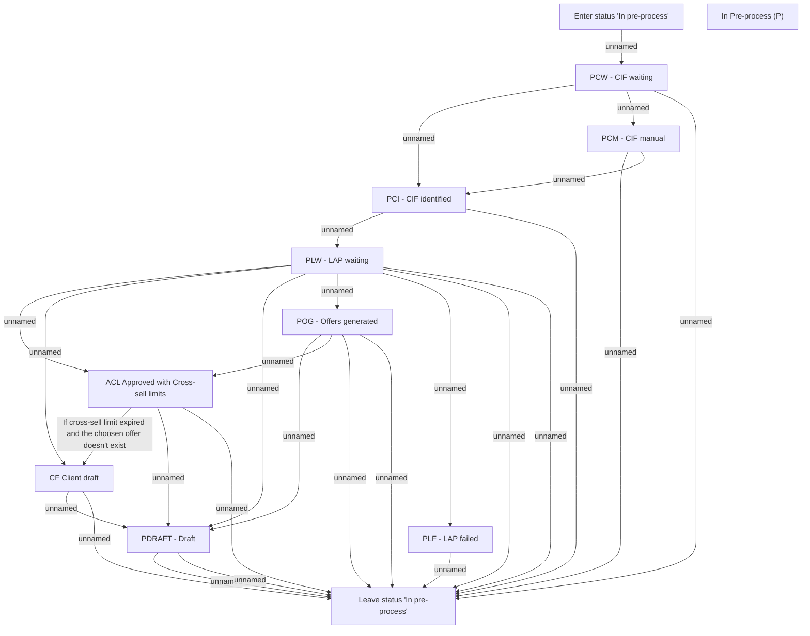

# In Pre-process (P)

```mermaid
graph TD
    ACL_Approved_with_Cross_sell_limits["ACL Approved with Cross-sell limits"]
    CF_Client_draft["CF Client draft"]
    PDRAFT_Draft["PDRAFT - Draft"]
    POG_Offers_generated["POG - Offers generated"]
    PLF_LAP_failed["PLF - LAP failed"]
    PLW_LAP_waiting["PLW - LAP waiting"]
    PCI_CIF_identified["PCI - CIF identified"]
    PCM_CIF_manual["PCM - CIF manual"]
    PCW_CIF_waiting["PCW - CIF waiting"]
    Leave_status_In_pre_process["Leave status 'In pre-process'"]
    Enter_status_In_pre_process["Enter status 'In pre-process'"]
    In_Pre_process_P["In Pre-process (P)"]
    Enter_status_In_pre_process -->|unnamed| PCW_CIF_waiting
    PLW_LAP_waiting -->|unnamed| ACL_Approved_with_Cross_sell_limits
    PLW_LAP_waiting -->|unnamed| CF_Client_draft
    ACL_Approved_with_Cross_sell_limits -->|If cross-sell limit expired and the choosen offer doesn't exist| CF_Client_draft
    ACL_Approved_with_Cross_sell_limits -->|unnamed| PDRAFT_Draft
    POG_Offers_generated -->|unnamed| PDRAFT_Draft
    CF_Client_draft -->|unnamed| PDRAFT_Draft
    PLW_LAP_waiting -->|unnamed| PDRAFT_Draft
    PLW_LAP_waiting -->|unnamed| POG_Offers_generated
    PLW_LAP_waiting -->|unnamed| PLF_LAP_failed
    PCI_CIF_identified -->|unnamed| PLW_LAP_waiting
    PCW_CIF_waiting -->|unnamed| PCI_CIF_identified
    POG_Offers_generated -->|unnamed| ACL_Approved_with_Cross_sell_limits
    PCW_CIF_waiting -->|unnamed| PCM_CIF_manual
    PCW_CIF_waiting -->|unnamed| Leave_status_In_pre_process
    PLW_LAP_waiting -->|unnamed| Leave_status_In_pre_process
    CF_Client_draft -->|unnamed| Leave_status_In_pre_process
    PDRAFT_Draft -->|unnamed| Leave_status_In_pre_process
    POG_Offers_generated -->|unnamed| Leave_status_In_pre_process
    POG_Offers_generated -->|unnamed| Leave_status_In_pre_process
    PDRAFT_Draft -->|unnamed| Leave_status_In_pre_process
    PLF_LAP_failed -->|unnamed| Leave_status_In_pre_process
    ACL_Approved_with_Cross_sell_limits -->|unnamed| Leave_status_In_pre_process
    PLW_LAP_waiting -->|unnamed| Leave_status_In_pre_process
    PCI_CIF_identified -->|unnamed| Leave_status_In_pre_process
    PCM_CIF_manual -->|unnamed| Leave_status_In_pre_process
    PCM_CIF_manual -->|unnamed| PCI_CIF_identified
```
