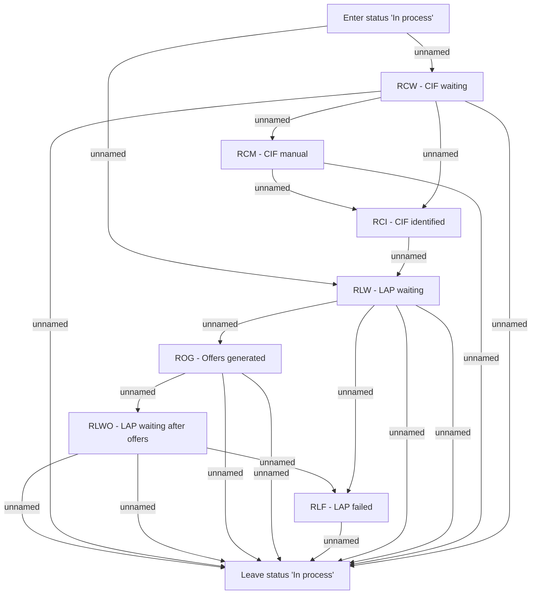

# In Process (R)

```mermaid
graph TD
    RLWO_LAP_waiting_after_offers["RLWO - LAP waiting after offers"]
    ROG_Offers_generated["ROG - Offers generated"]
    RLF_LAP_failed["RLF - LAP failed"]
    RLW_LAP_waiting["RLW - LAP waiting"]
    RCI_CIF_identified["RCI - CIF identified"]
    RCM_CIF_manual["RCM - CIF manual"]
    RCW_CIF_waiting["RCW - CIF waiting"]
    Leave_status_In_process["Leave status 'In process'"]
    Enter_status_In_process["Enter status 'In process'"]
    RLWO_LAP_waiting_after_offers -->|unnamed| Leave_status_In_process
    RLW_LAP_waiting -->|unnamed| ROG_Offers_generated
    RLWO_LAP_waiting_after_offers -->|unnamed| RLF_LAP_failed
    RLW_LAP_waiting -->|unnamed| RLF_LAP_failed
    Enter_status_In_process -->|unnamed| RLW_LAP_waiting
    RCI_CIF_identified -->|unnamed| RLW_LAP_waiting
    RCM_CIF_manual -->|unnamed| RCI_CIF_identified
    RCW_CIF_waiting -->|unnamed| RCI_CIF_identified
    ROG_Offers_generated -->|unnamed| RLWO_LAP_waiting_after_offers
    Enter_status_In_process -->|unnamed| RCW_CIF_waiting
    RCW_CIF_waiting -->|unnamed| Leave_status_In_process
    RLWO_LAP_waiting_after_offers -->|unnamed| Leave_status_In_process
    ROG_Offers_generated -->|unnamed| Leave_status_In_process
    ROG_Offers_generated -->|unnamed| Leave_status_In_process
    RLF_LAP_failed -->|unnamed| Leave_status_In_process
    RLW_LAP_waiting -->|unnamed| Leave_status_In_process
    RLW_LAP_waiting -->|unnamed| Leave_status_In_process
    RCM_CIF_manual -->|unnamed| Leave_status_In_process
    RCW_CIF_waiting -->|unnamed| Leave_status_In_process
    RCW_CIF_waiting -->|unnamed| RCM_CIF_manual
```
