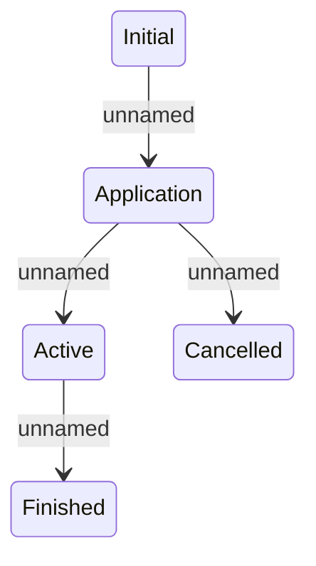

# StateTransitions

- **Diagram Type**: Statechart
- **Package**: HomerSelect/BSL/Analysis Model/Contract Management/COMMON for Contract Management/Logical Data Model
- **Diagram ID**: 164483
- **Elements**: 5
- **Connectors**: 4

