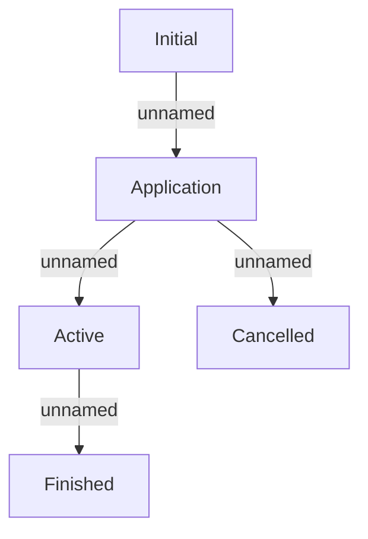

# StateTransitions

```mermaid
graph TD
    Finished["Finished"]
    Active["Active"]
    Cancelled["Cancelled"]
    Application["Application"]
    Initial["Initial"]
    Initial -->|unnamed| Application
    Application -->|unnamed| Cancelled
    Application -->|unnamed| Active
    Active -->|unnamed| Finished
```
