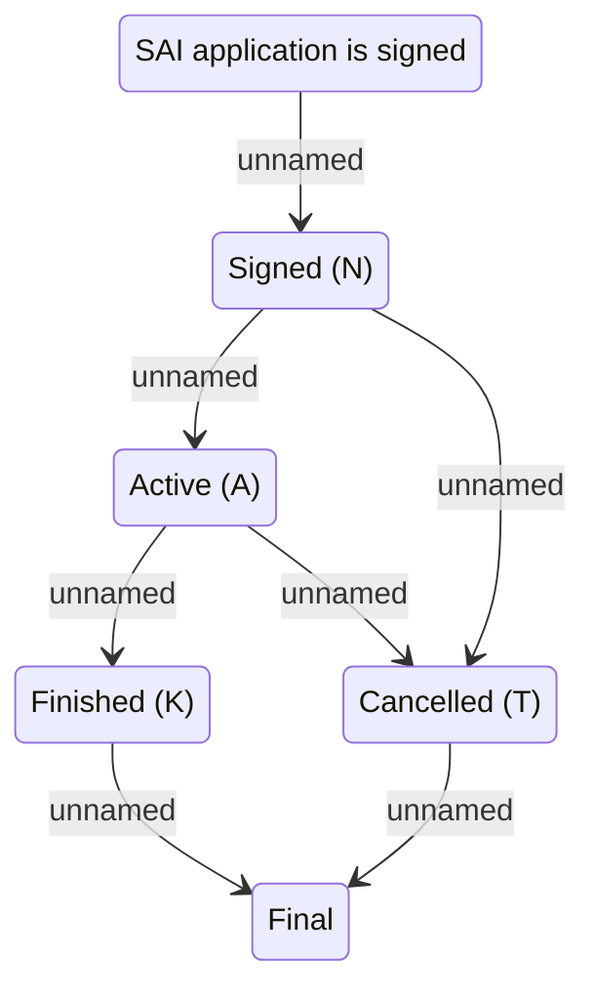

# SAI Statechart Model

- **Diagram Type**: Statechart
- **Package**: HomerSelect/BSL/Analysis Model/Contract Management/COMMON for Contract Management/SAI Statechart Model
- **Diagram ID**: 108575
- **Elements**: 6
- **Connectors**: 7

