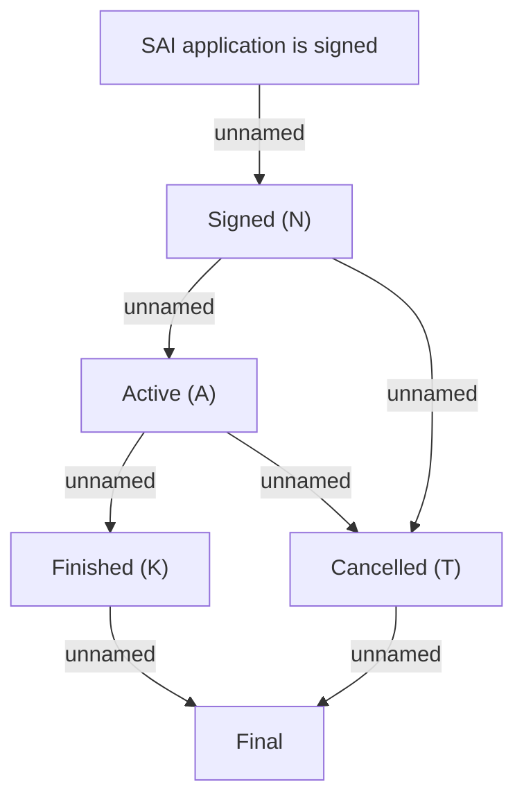

# SAI Statechart Model

```mermaid
graph TD
    SAI_application_is_signed["SAI application is signed"]
    Final["Final"]
    Finished_K["Finished (K)"]
    Active_A["Active (A)"]
    Signed_N["Signed (N)"]
    Cancelled_T["Cancelled (T)"]
    SAI_application_is_signed -->|unnamed| Signed_N
    Active_A -->|unnamed| Cancelled_T
    Signed_N -->|unnamed| Cancelled_T
    Finished_K -->|unnamed| Final
    Cancelled_T -->|unnamed| Final
    Active_A -->|unnamed| Finished_K
    Signed_N -->|unnamed| Active_A
```
