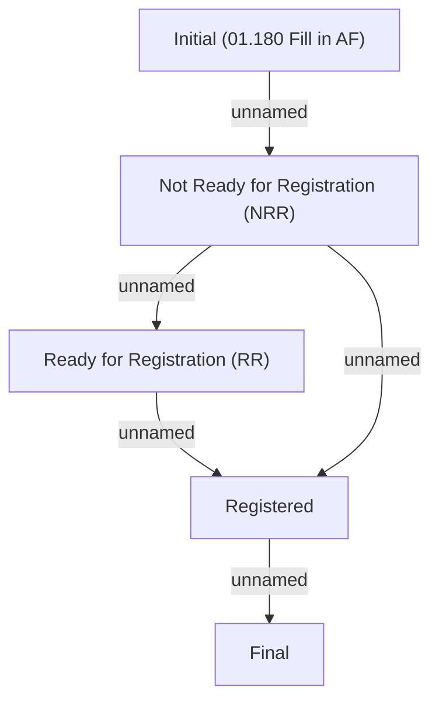

# Registration Status Transition

```mermaid
graph TD
    Final["Final"]
    Registered["Registered"]
    Ready_for_Registration_RR["Ready for Registration (RR)"]
    Not_Ready_for_Registration_NRR["Not Ready for Registration (NRR)"]
    Initial_01_180_Fill_in_AF["Initial (01.180 Fill in AF)"]
    Ready_for_Registration_RR -->|unnamed| Registered
    Not_Ready_for_Registration_NRR -->|unnamed| Registered
    Registered -->|unnamed| Final
    Initial_01_180_Fill_in_AF -->|unnamed| Not_Ready_for_Registration_NRR
    Not_Ready_for_Registration_NRR -->|unnamed| Ready_for_Registration_RR
```
