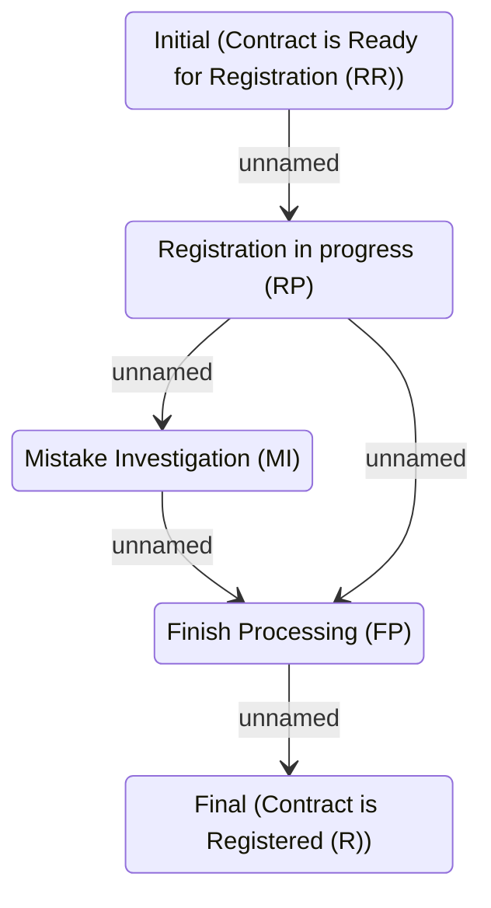

# Registration Task Transition

- **Diagram Type**: Statechart
- **Package**: HomerSelect/BSL/Analysis Model/Contract Management/Contract registration/Contract Registration Statechart
- **Diagram ID**: 98164
- **Elements**: 5
- **Connectors**: 5

