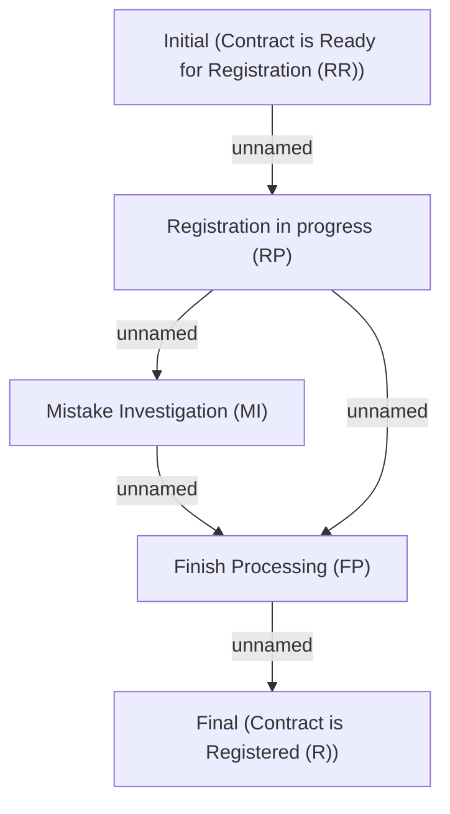

# Registration Task Transition

```mermaid
graph TD
    Final_Contract_is_Registered_R["Final (Contract is Registered (R))"]
    Mistake_Investigation_MI["Mistake Investigation (MI)"]
    Registration_in_progress_RP["Registration in progress (RP)"]
    Finish_Processing_FP["Finish Processing (FP)"]
    Initial_Contract_is_Ready_for_Registration_RR["Initial (Contract is Ready for Registration (RR))"]
    Mistake_Investigation_MI -->|unnamed| Finish_Processing_FP
    Registration_in_progress_RP -->|unnamed| Finish_Processing_FP
    Initial_Contract_is_Ready_for_Registration_RR -->|unnamed| Registration_in_progress_RP
    Registration_in_progress_RP -->|unnamed| Mistake_Investigation_MI
    Finish_Processing_FP -->|unnamed| Final_Contract_is_Registered_R
```
