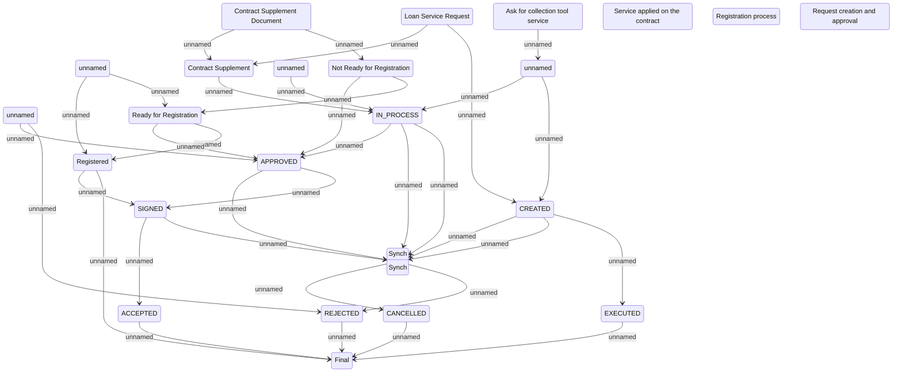

# Collection tool service request lifecycle

- **Diagram Type**: Statechart
- **Package**: HomerSelect/BSL/Analysis Model/Contract Management/Loan Service Processing/Collection tools support/Collection tool service lifecycle
- **Diagram ID**: 75353
- **Elements**: 25
- **Connectors**: 35

