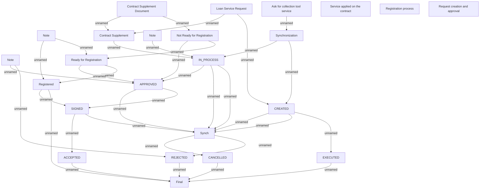

# Collection tool service request lifecycle

```mermaid
graph TD
    Synch["Synch"]
    el_965122["Note"]
    el_965121["Note"]
    REJECTED["REJECTED"]
    Registered["Registered"]
    Ready_for_Registration["Ready for Registration"]
    Not_Ready_for_Registration["Not Ready for Registration"]
    Contract_Supplement_Document["Contract Supplement Document"]
    el_965123["Note"]
    Final["Final"]
    EXECUTED["EXECUTED"]
    SIGNED["SIGNED"]
    APPROVED["APPROVED"]
    ACCEPTED["ACCEPTED"]
    Synch["Synch"]
    CANCELLED["CANCELLED"]
    IN_PROCESS["IN_PROCESS"]
    CREATED["CREATED"]
    el_965143["Synchronization"]
    Loan_Service_Request["Loan Service Request"]
    Contract_Supplement["Contract Supplement"]
    Ask_for_collection_tool_service["Ask for collection tool service"]
    Service_applied_on_the_contract["Service applied on the contract"]
    Registration_process["Registration process"]
    Request_creation_and_approval["Request creation and approval"]
    Not_Ready_for_Registration -->|unnamed| Ready_for_Registration
    APPROVED -->|unnamed| SIGNED
    CREATED -->|unnamed| EXECUTED
    REJECTED -->|unnamed| Final
    Registered -->|unnamed| Final
    CANCELLED -->|unnamed| Final
    ACCEPTED -->|unnamed| Final
    CREATED -->|unnamed| Synch
    Contract_Supplement_Document -->|unnamed| Not_Ready_for_Registration
    Not_Ready_for_Registration -->|unnamed| APPROVED
    el_965122 -->|unnamed| Ready_for_Registration
    Ready_for_Registration -->|unnamed| Registered
    el_965122 -->|unnamed| Registered
    el_965121 -->|unnamed| REJECTED
    Synch -->|unnamed| REJECTED
    IN_PROCESS -->|unnamed| Synch
    EXECUTED -->|unnamed| Final
    SIGNED -->|unnamed| Synch
    Contract_Supplement_Document -->|unnamed| Contract_Supplement
    Ask_for_collection_tool_service -->|unnamed| el_965143
    Loan_Service_Request -->|unnamed| CREATED
    el_965143 -->|unnamed| CREATED
    el_965123 -->|unnamed| IN_PROCESS
    Contract_Supplement -->|unnamed| IN_PROCESS
    Registered -->|unnamed| SIGNED
    Synch -->|unnamed| CANCELLED
    Ready_for_Registration -->|unnamed| APPROVED
    CREATED -->|unnamed| Synch
    APPROVED -->|unnamed| Synch
    IN_PROCESS -->|unnamed| Synch
    SIGNED -->|unnamed| ACCEPTED
    el_965121 -->|unnamed| APPROVED
    IN_PROCESS -->|unnamed| APPROVED
    Loan_Service_Request -->|unnamed| Contract_Supplement
    el_965143 -->|unnamed| IN_PROCESS
```
