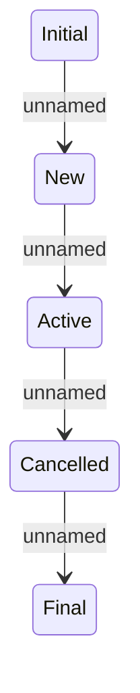

# Statuses

- **Diagram Type**: Statechart
- **Package**: HomerSelect/BSL/Analysis Model/Contract Origination/Loan origination configuration /User Interface Model/Personal Document Container/Personal Document Container Detail/Statuses
- **Diagram ID**: 118864
- **Elements**: 5
- **Connectors**: 4

