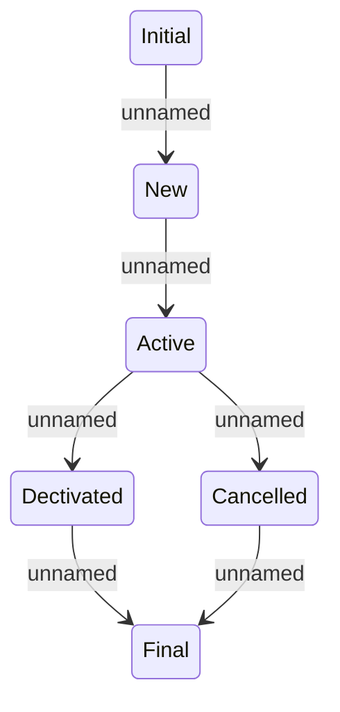

# Statuses

- **Diagram Type**: Statechart
- **Package**: HomerSelect/BSL/Analysis Model/Contract Origination/Loan origination configuration /User Interface Model/Subprocess/Subprocess detail/Statuses
- **Diagram ID**: 124341
- **Elements**: 6
- **Connectors**: 6

