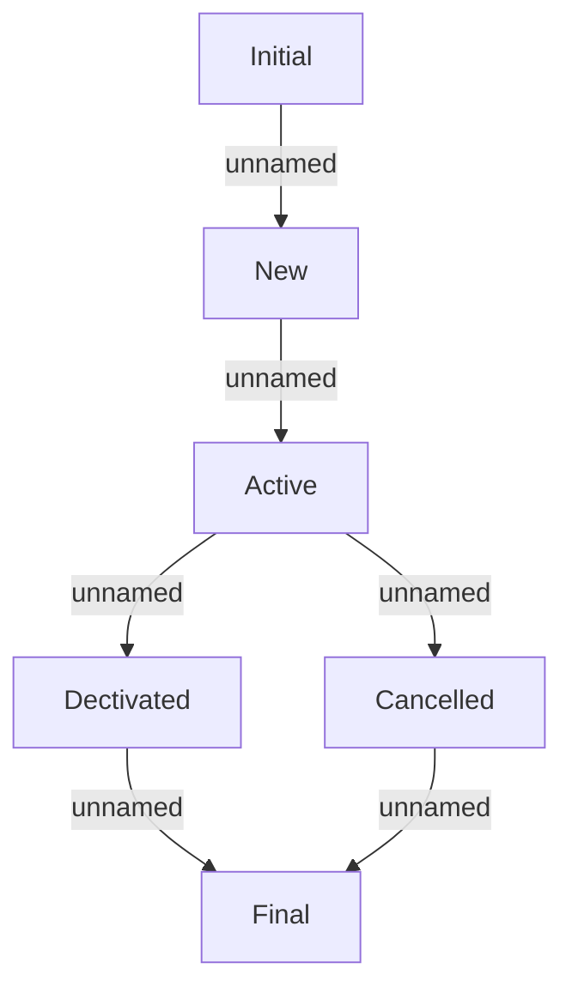

# Statuses

```mermaid
graph TD
    Dectivated["Dectivated"]
    Final["Final"]
    Cancelled["Cancelled"]
    Active["Active"]
    New["New"]
    Initial["Initial"]
    Initial -->|unnamed| New
    New -->|unnamed| Active
    Active -->|unnamed| Cancelled
    Dectivated -->|unnamed| Final
    Cancelled -->|unnamed| Final
    Active -->|unnamed| Dectivated
```
