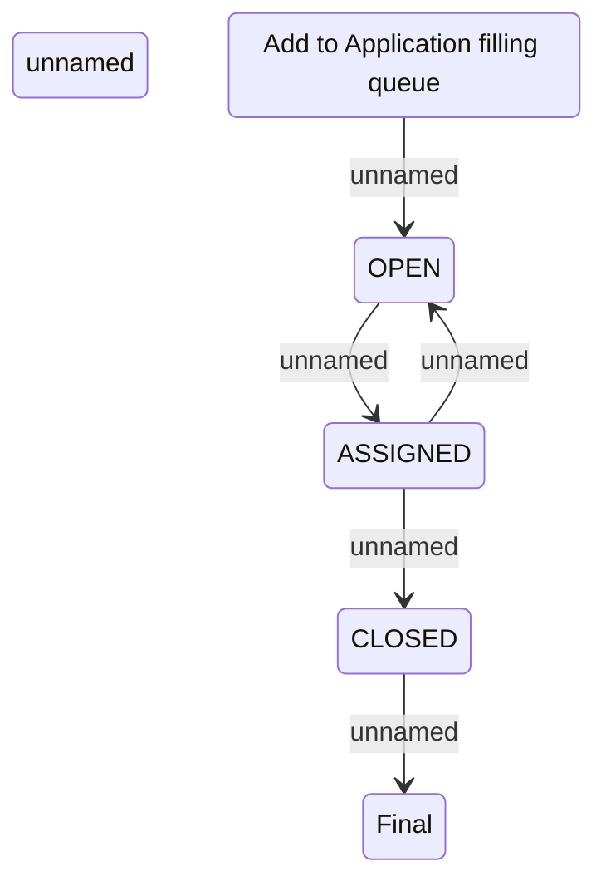

# State diagram of 2BoD application filling

- **Diagram Type**: Statechart
- **Package**: HomerSelect/BSL/Analysis Model/Contract Origination/Support for 2BoD Processing/State diagram of 2BoD application filling
- **Diagram ID**: 63482
- **Elements**: 6
- **Connectors**: 5

