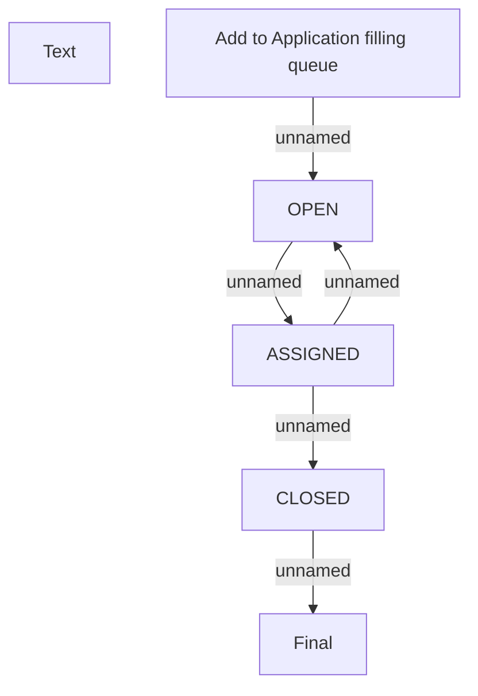

# State diagram of 2BoD application filling

```mermaid
graph TD
    Final["Final"]
    el_823925["Text"]
    Add_to_Application_filling_queue["Add to Application filling queue"]
    ASSIGNED["ASSIGNED"]
    CLOSED["CLOSED"]
    OPEN["OPEN"]
    Add_to_Application_filling_queue -->|unnamed| OPEN
    ASSIGNED -->|unnamed| OPEN
    ASSIGNED -->|unnamed| CLOSED
    OPEN -->|unnamed| ASSIGNED
    CLOSED -->|unnamed| Final
```
