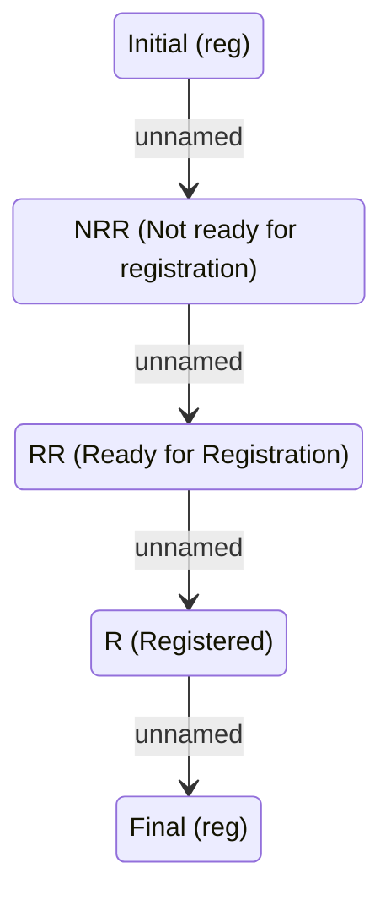

# Contract Supplement registration lifecycle

- **Diagram Type**: Statechart
- **Package**: HomerSelect/BSL/Analysis Model/Contract Supplements/COMMON for Supplements/Contract Supplement operations/Contract Supplement registration/Contract Supplement registration lifecycle
- **Diagram ID**: 162865
- **Elements**: 5
- **Connectors**: 4

