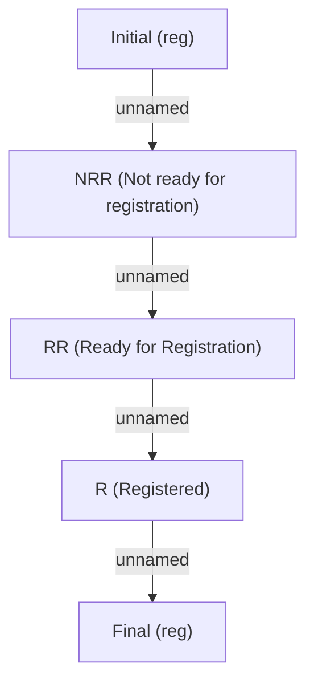

# Contract Supplement registration lifecycle

```mermaid
graph TD
    Final_reg["Final (reg)"]
    R_Registered["R (Registered)"]
    RR_Ready_for_Registration["RR (Ready for Registration)"]
    NRR_Not_ready_for_registration["NRR (Not ready for registration)"]
    Initial_reg["Initial (reg)"]
    Initial_reg -->|unnamed| NRR_Not_ready_for_registration
    NRR_Not_ready_for_registration -->|unnamed| RR_Ready_for_Registration
    RR_Ready_for_Registration -->|unnamed| R_Registered
    R_Registered -->|unnamed| Final_reg
```
