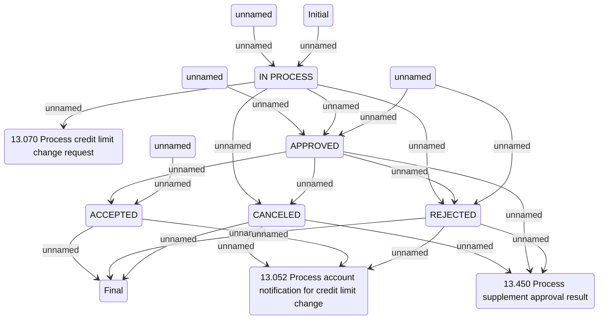

# Credit limit change lifecycle

- **Diagram Type**: Statechart
- **Package**: HomerSelect/BSL/Analysis Model/Contract Supplements/Credit limit change support/Credit limit change lifecycle
- **Diagram ID**: 162641
- **Elements**: 14
- **Connectors**: 22

