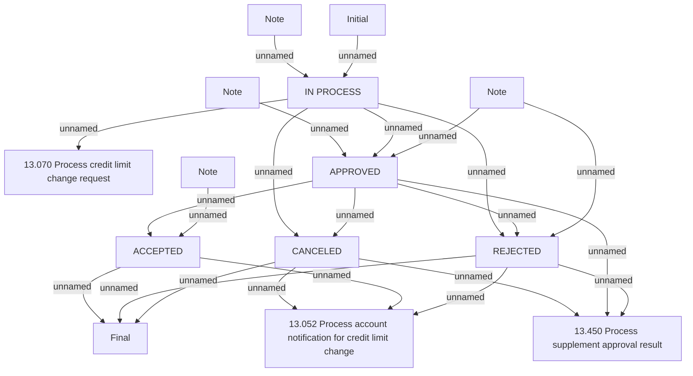

# Credit limit change lifecycle

```mermaid
graph TD
    n_13_070_Process_credit_limit_change_request["13.070 Process credit limit change request"]
    n_13_450_Process_supplement_approval_result["13.450 Process supplement approval result"]
    n_13_052_Process_account_notification_for_credit_limit_chang["13.052 Process account notification for credit limit change"]
    el_1861694["Note"]
    el_1861699["Note"]
    el_1861697["Note"]
    el_1861693["Note"]
    REJECTED["REJECTED"]
    ACCEPTED["ACCEPTED"]
    Final["Final"]
    CANCELED["CANCELED"]
    APPROVED["APPROVED"]
    IN_PROCESS["IN PROCESS"]
    Initial["Initial"]
    el_1861697 -->|unnamed| APPROVED
    el_1861697 -->|unnamed| REJECTED
    APPROVED -->|unnamed| REJECTED
    el_1861699 -->|unnamed| ACCEPTED
    APPROVED -->|unnamed| ACCEPTED
    CANCELED -->|unnamed| Final
    REJECTED -->|unnamed| Final
    ACCEPTED -->|unnamed| Final
    APPROVED -->|unnamed| CANCELED
    IN_PROCESS -->|unnamed| REJECTED
    IN_PROCESS -->|unnamed| APPROVED
    IN_PROCESS -->|unnamed| n_13_070_Process_credit_limit_change_request
    el_1861694 -->|unnamed| APPROVED
    Initial -->|unnamed| IN_PROCESS
    el_1861693 -->|unnamed| IN_PROCESS
    REJECTED -->|unnamed| n_13_052_Process_account_notification_for_credit_limit_chang
    ACCEPTED -->|unnamed| n_13_052_Process_account_notification_for_credit_limit_chang
    CANCELED -->|unnamed| n_13_052_Process_account_notification_for_credit_limit_chang
    REJECTED -->|unnamed| n_13_450_Process_supplement_approval_result
    APPROVED -->|unnamed| n_13_450_Process_supplement_approval_result
    CANCELED -->|unnamed| n_13_450_Process_supplement_approval_result
    IN_PROCESS -->|unnamed| CANCELED
```
