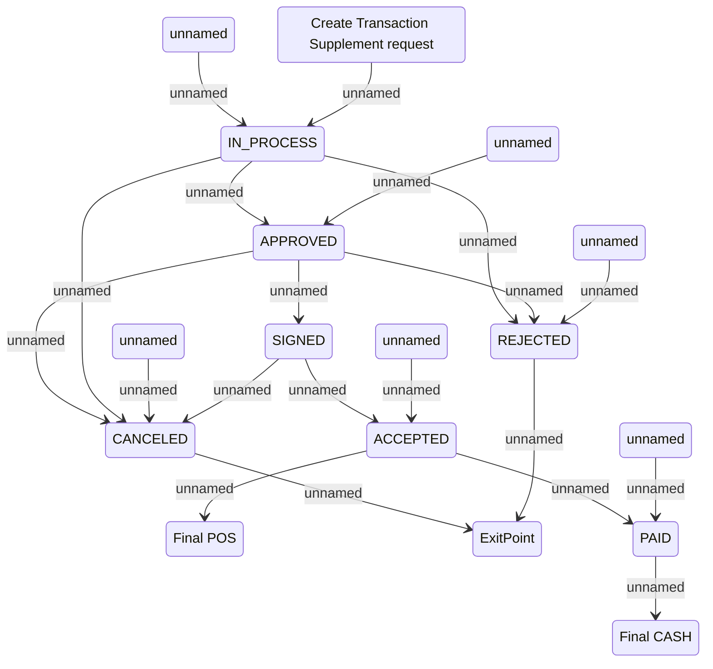

# Transaction Supplement lifecycle

- **Diagram Type**: Statechart
- **Package**: HomerSelect/BSL/Analysis Model/Contract Supplements/Transaction Supplement support/Use case model/Transaction Supplement lifecycle
- **Diagram ID**: 144138
- **Elements**: 17
- **Connectors**: 20

