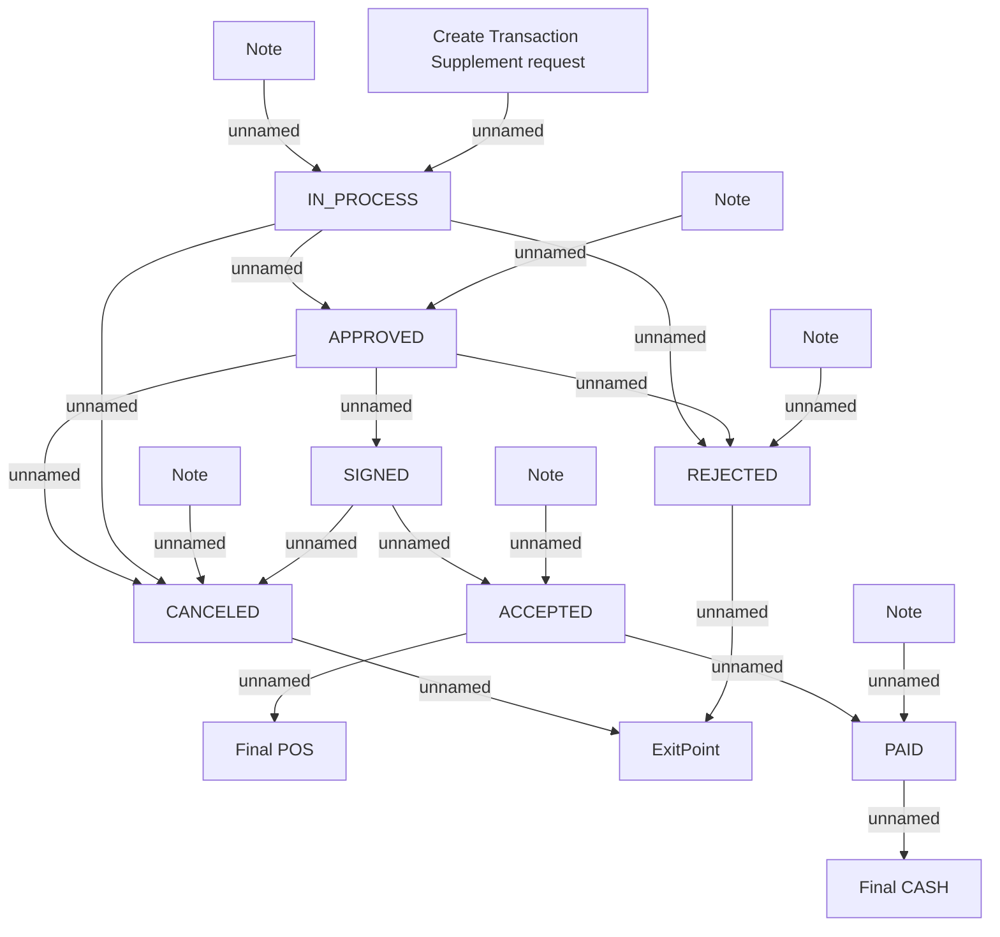

# Transaction Supplement lifecycle

```mermaid
graph TD
    Final_POS["Final POS"]
    el_1682017["Note"]
    SIGNED["SIGNED"]
    el_1682020["Note"]
    el_1682014["Note"]
    el_1682019["Note"]
    el_1682016["Note"]
    el_1682015["Note"]
    Final_CASH["Final CASH"]
    ExitPoint["ExitPoint"]
    PAID["PAID"]
    ACCEPTED["ACCEPTED"]
    REJECTED["REJECTED"]
    CANCELED["CANCELED"]
    APPROVED["APPROVED"]
    IN_PROCESS["IN_PROCESS"]
    Create_Transaction_Supplement_request["Create Transaction Supplement request"]
    el_1682014 -->|unnamed| REJECTED
    PAID -->|unnamed| Final_CASH
    REJECTED -->|unnamed| ExitPoint
    CANCELED -->|unnamed| ExitPoint
    el_1682019 -->|unnamed| PAID
    ACCEPTED -->|unnamed| PAID
    el_1682016 -->|unnamed| ACCEPTED
    SIGNED -->|unnamed| ACCEPTED
    APPROVED -->|unnamed| SIGNED
    APPROVED -->|unnamed| REJECTED
    ACCEPTED -->|unnamed| Final_POS
    SIGNED -->|unnamed| CANCELED
    el_1682017 -->|unnamed| CANCELED
    IN_PROCESS -->|unnamed| CANCELED
    APPROVED -->|unnamed| CANCELED
    el_1682020 -->|unnamed| APPROVED
    IN_PROCESS -->|unnamed| APPROVED
    Create_Transaction_Supplement_request -->|unnamed| IN_PROCESS
    el_1682015 -->|unnamed| IN_PROCESS
    IN_PROCESS -->|unnamed| REJECTED
```
