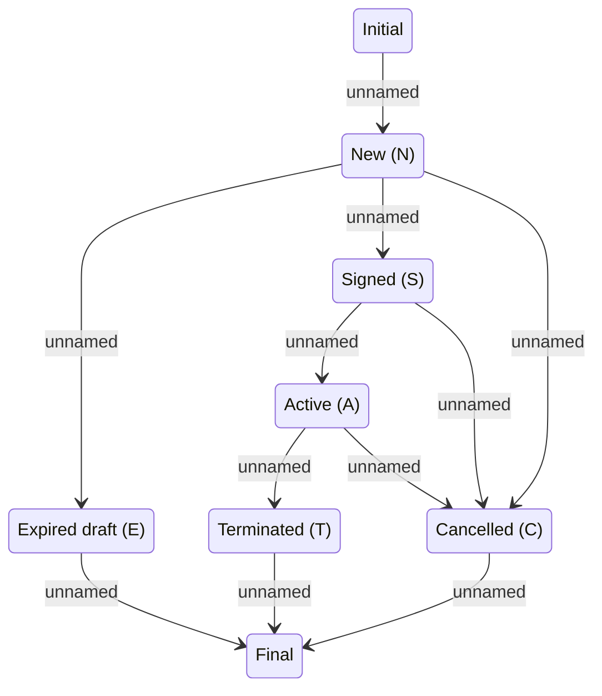

# Insurance Contract Status

- **Diagram Type**: Statechart
- **Package**: HomerSelect/BSL/Analysis Model/Insurance/Insurance Contract/Logical Data Model/Insurance Contract Statechart
- **Diagram ID**: 98835
- **Elements**: 8
- **Connectors**: 11

