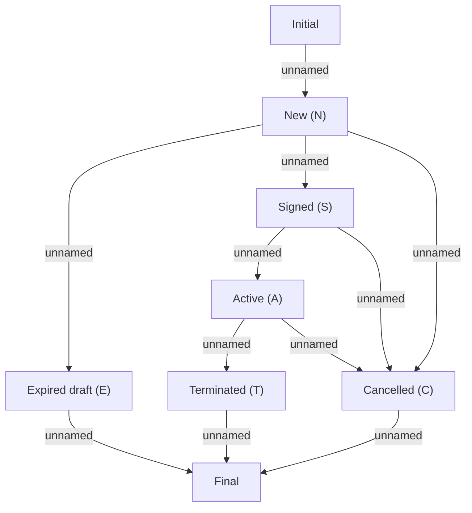

# Insurance Contract Status

```mermaid
graph TD
    Final["Final"]
    Expired_draft_E["Expired draft (E)"]
    Terminated_T["Terminated (T)"]
    Cancelled_C["Cancelled (C)"]
    Active_A["Active (A)"]
    Signed_S["Signed (S)"]
    New_N["New (N)"]
    Initial["Initial"]
    Initial -->|unnamed| New_N
    New_N -->|unnamed| Signed_S
    Signed_S -->|unnamed| Active_A
    Active_A -->|unnamed| Cancelled_C
    Signed_S -->|unnamed| Cancelled_C
    New_N -->|unnamed| Cancelled_C
    Active_A -->|unnamed| Terminated_T
    New_N -->|unnamed| Expired_draft_E
    Expired_draft_E -->|unnamed| Final
    Terminated_T -->|unnamed| Final
    Cancelled_C -->|unnamed| Final
```
