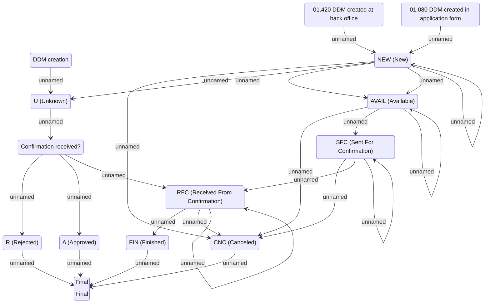

# DDM Statechart model

- **Diagram Type**: Statechart
- **Package**: HomerSelect/BSL/Analysis Model/Payments/Direct Debit Mandate (DDM)/COMMON for DDM/Statechart model
- **Diagram ID**: 80221
- **Elements**: 15
- **Connectors**: 25

