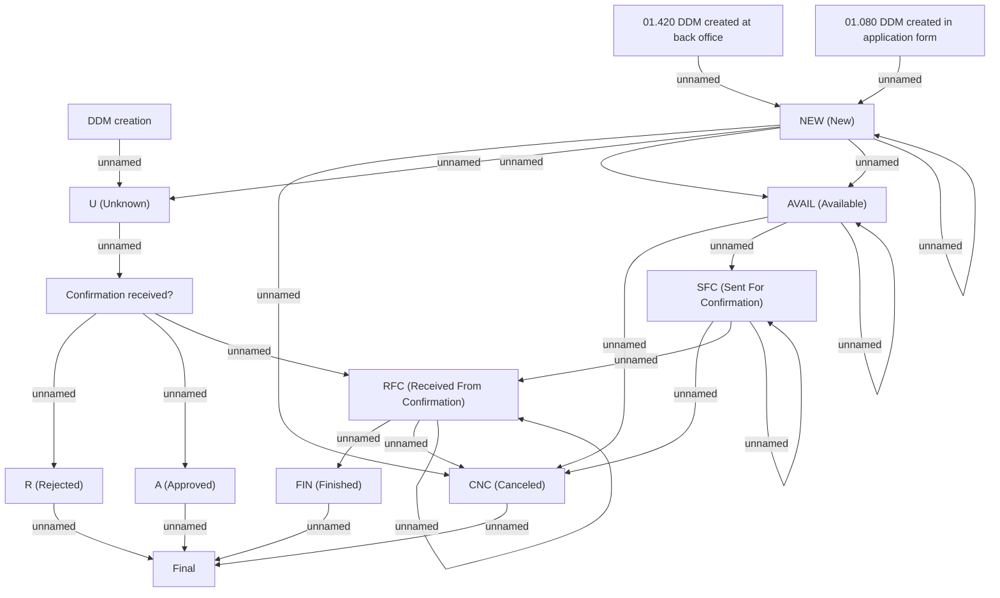

# DDM Statechart model

```mermaid
graph TD
    CNC_Canceled["CNC (Canceled)"]
    DDM_creation["DDM creation"]
    Final["Final"]
    R_Rejected["R (Rejected)"]
    A_Approved["A (Approved)"]
    Confirmation_received["Confirmation received?"]
    U_Unknown["U (Unknown)"]
    Final["Final"]
    FIN_Finished["FIN (Finished)"]
    RFC_Received_From_Confirmation["RFC (Received From Confirmation)"]
    SFC_Sent_For_Confirmation["SFC (Sent For Confirmation)"]
    AVAIL_Available["AVAIL (Available)"]
    NEW_New["NEW (New)"]
    n_01_080_DDM_created_in_application_form["01.080 DDM created in application form"]
    n_01_420_DDM_created_at_back_office["01.420 DDM created at back office"]
    RFC_Received_From_Confirmation -->|unnamed| FIN_Finished
    SFC_Sent_For_Confirmation -->|unnamed| CNC_Canceled
    AVAIL_Available -->|unnamed| CNC_Canceled
    NEW_New -->|unnamed| CNC_Canceled
    R_Rejected -->|unnamed| Final
    A_Approved -->|unnamed| Final
    Confirmation_received -->|unnamed| R_Rejected
    Confirmation_received -->|unnamed| A_Approved
    U_Unknown -->|unnamed| Confirmation_received
    NEW_New -->|unnamed| U_Unknown
    DDM_creation -->|unnamed| U_Unknown
    RFC_Received_From_Confirmation -->|unnamed| CNC_Canceled
    FIN_Finished -->|unnamed| Final
    n_01_420_DDM_created_at_back_office -->|unnamed| NEW_New
    Confirmation_received -->|unnamed| RFC_Received_From_Confirmation
    RFC_Received_From_Confirmation -->|unnamed| RFC_Received_From_Confirmation
    SFC_Sent_For_Confirmation -->|unnamed| RFC_Received_From_Confirmation
    SFC_Sent_For_Confirmation -->|unnamed| SFC_Sent_For_Confirmation
    AVAIL_Available -->|unnamed| SFC_Sent_For_Confirmation
    NEW_New -->|unnamed| AVAIL_Available
    NEW_New -->|unnamed| AVAIL_Available
    AVAIL_Available -->|unnamed| AVAIL_Available
    NEW_New -->|unnamed| NEW_New
    n_01_080_DDM_created_in_application_form -->|unnamed| NEW_New
    CNC_Canceled -->|unnamed| Final
```
