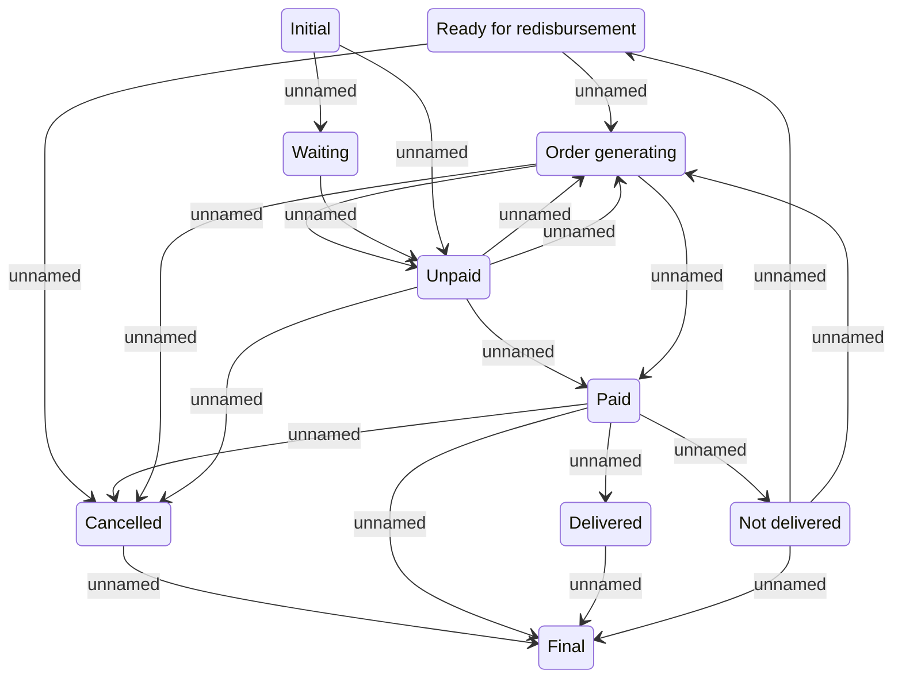

# Outgoing payment state

- **Diagram Type**: Statechart
- **Package**: HomerSelect/BSL/Analysis Model/Payments/Outgoing payments/Process outgoing payments/Statechart
- **Diagram ID**: 100001
- **Elements**: 10
- **Connectors**: 21

