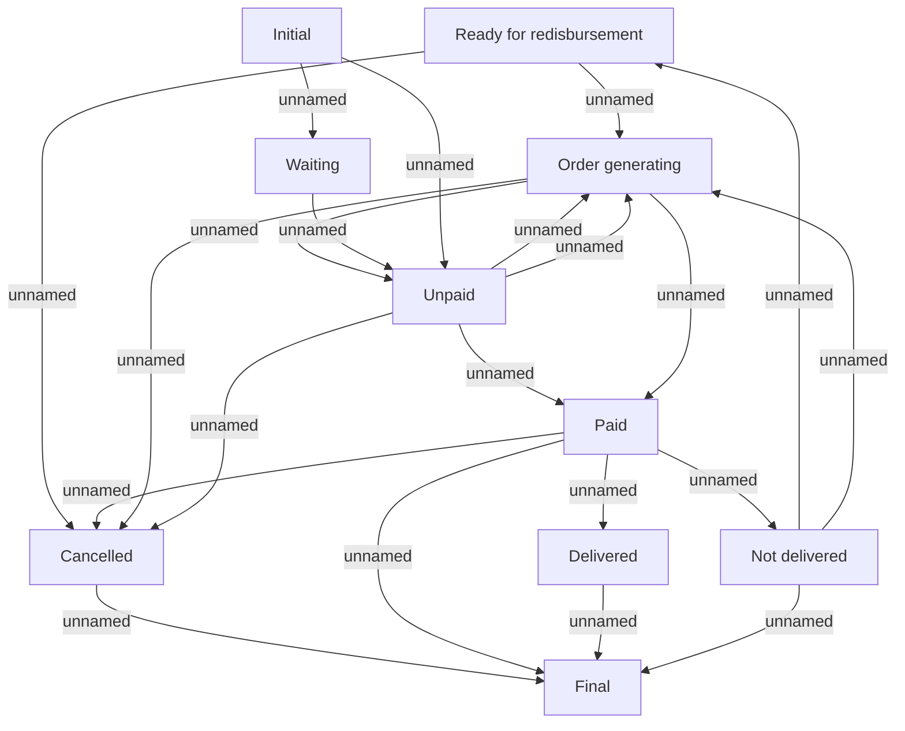

# Outgoing payment state

```mermaid
graph TD
    Ready_for_redisbursement["Ready for redisbursement"]
    Waiting["Waiting"]
    Not_delivered["Not delivered"]
    Delivered["Delivered"]
    Final["Final"]
    Paid["Paid"]
    Order_generating["Order generating"]
    Cancelled["Cancelled"]
    Unpaid["Unpaid"]
    Initial["Initial"]
    Unpaid -->|unnamed| Order_generating
    Initial -->|unnamed| Waiting
    Paid -->|unnamed| Not_delivered
    Paid -->|unnamed| Delivered
    Cancelled -->|unnamed| Final
    Paid -->|unnamed| Final
    Delivered -->|unnamed| Final
    Not_delivered -->|unnamed| Final
    Unpaid -->|unnamed| Paid
    Not_delivered -->|unnamed| Ready_for_redisbursement
    Unpaid -->|unnamed| Order_generating
    Order_generating -->|unnamed| Unpaid
    Not_delivered -->|unnamed| Order_generating
    Ready_for_redisbursement -->|unnamed| Order_generating
    Ready_for_redisbursement -->|unnamed| Cancelled
    Paid -->|unnamed| Cancelled
    Order_generating -->|unnamed| Cancelled
    Unpaid -->|unnamed| Cancelled
    Waiting -->|unnamed| Unpaid
    Initial -->|unnamed| Unpaid
    Order_generating -->|unnamed| Paid
```
