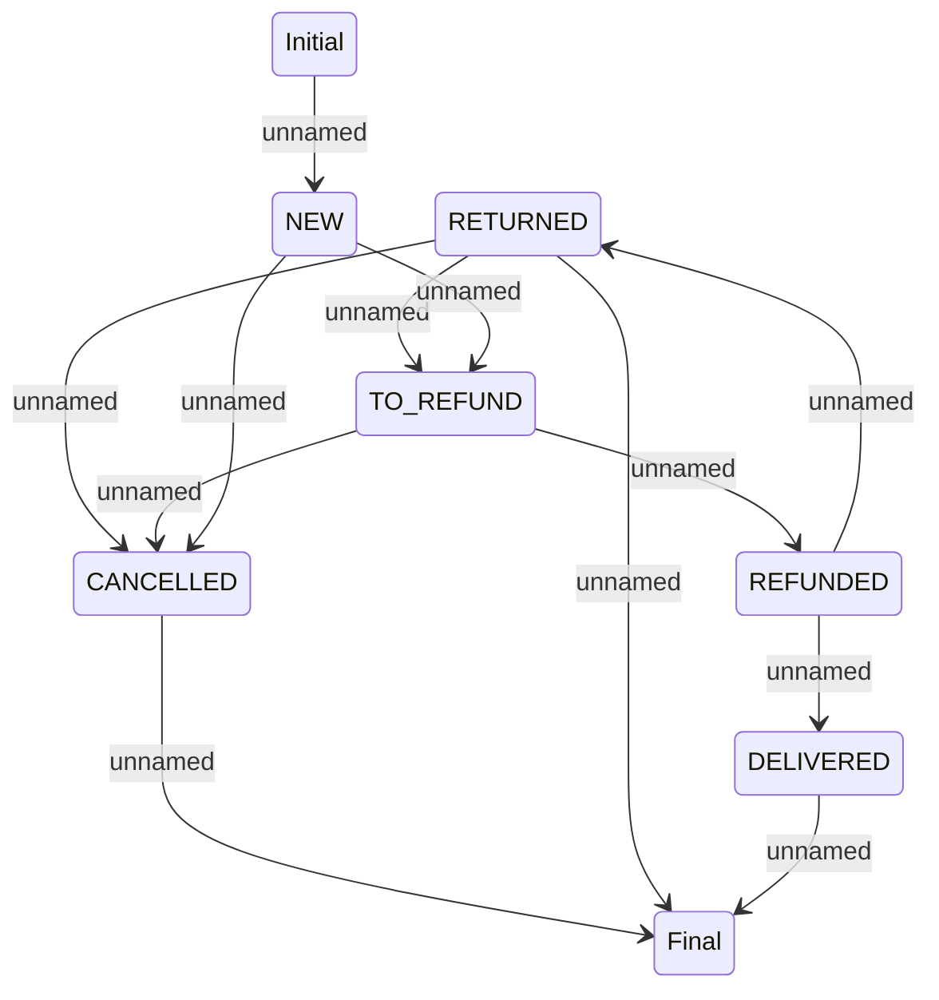

# Refund Statechart Model

- **Diagram Type**: Statechart
- **Package**: HomerSelect/BSL/Analysis Model/Payments/Refunds/COMMON for Refunds/Statechart Model
- **Diagram ID**: 164235
- **Elements**: 8
- **Connectors**: 12

