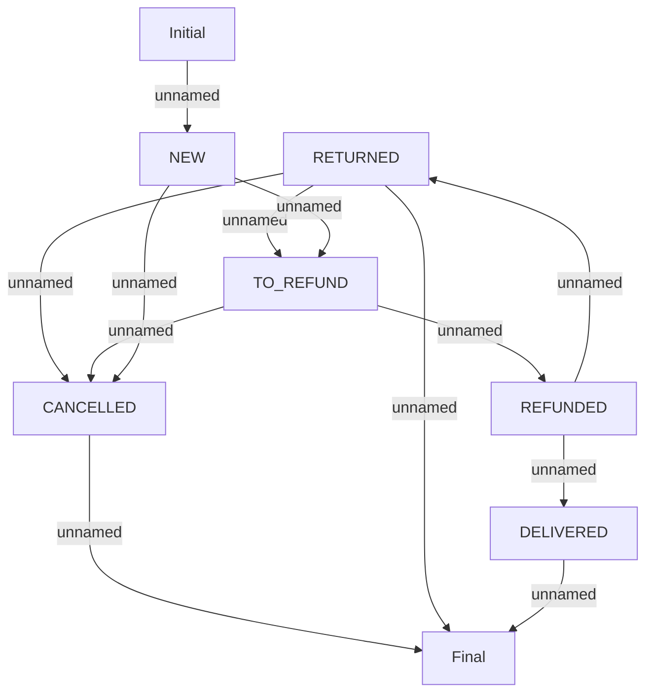

# Refund Statechart Model

```mermaid
graph TD
    CANCELLED["CANCELLED"]
    RETURNED["RETURNED"]
    DELIVERED["DELIVERED"]
    Final["Final"]
    Initial["Initial"]
    REFUNDED["REFUNDED"]
    TO_REFUND["TO_REFUND"]
    NEW["NEW"]
    Initial -->|unnamed| NEW
    RETURNED -->|unnamed| TO_REFUND
    NEW -->|unnamed| TO_REFUND
    TO_REFUND -->|unnamed| REFUNDED
    CANCELLED -->|unnamed| Final
    RETURNED -->|unnamed| Final
    DELIVERED -->|unnamed| Final
    REFUNDED -->|unnamed| DELIVERED
    REFUNDED -->|unnamed| RETURNED
    RETURNED -->|unnamed| CANCELLED
    TO_REFUND -->|unnamed| CANCELLED
    NEW -->|unnamed| CANCELLED
```
