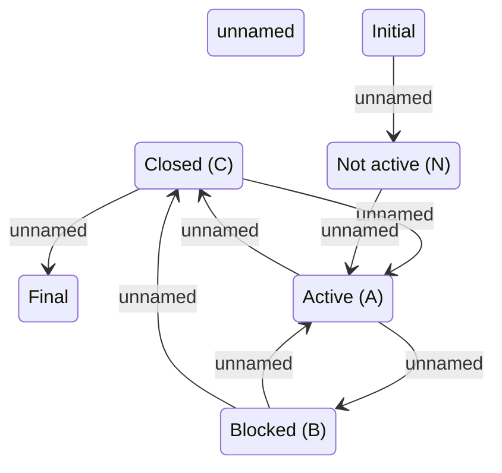

# Partner and Salesroom statechart

- **Diagram Type**: Statechart
- **Package**: HomerSelect/BSL/Analysis Model/Sales Network Management/COMMON for Sales Network Management/«functionality» COMMON for Common for Sales Network Management/Partner and Salesroom Statechart Model
- **Diagram ID**: 93633
- **Elements**: 7
- **Connectors**: 8

