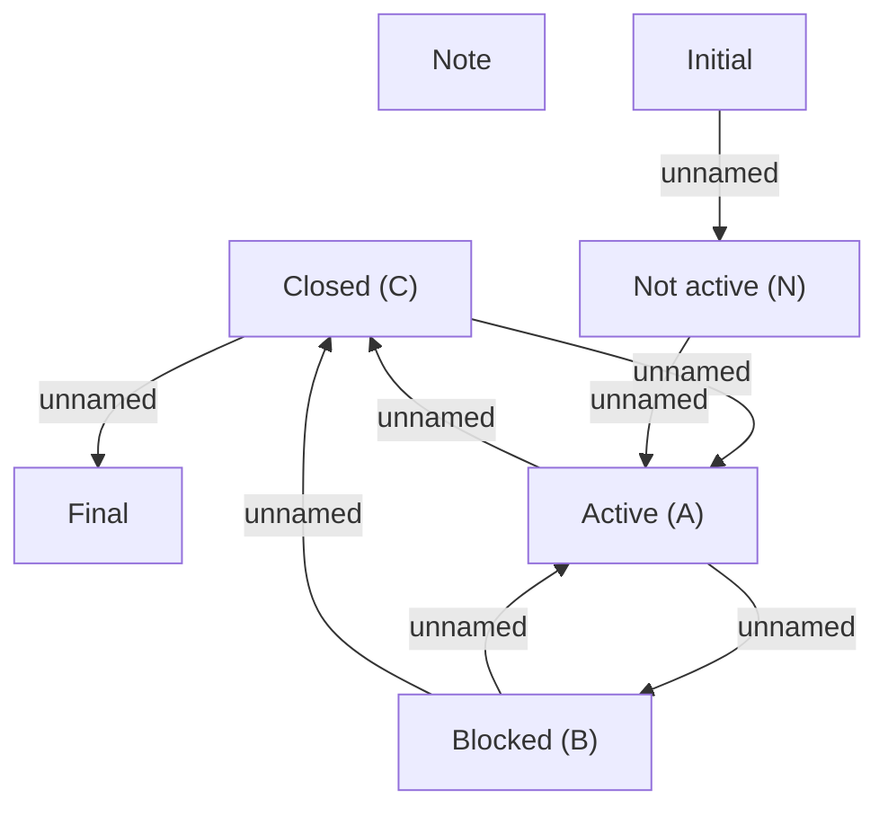

# Partner and Salesroom statechart

```mermaid
graph TD
    el_1166508["Note"]
    Final["Final"]
    Closed_C["Closed (C)"]
    Blocked_B["Blocked (B)"]
    Active_A["Active (A)"]
    Not_active_N["Not active (N)"]
    Initial["Initial"]
    Initial -->|unnamed| Not_active_N
    Closed_C -->|unnamed| Active_A
    Blocked_B -->|unnamed| Active_A
    Not_active_N -->|unnamed| Active_A
    Active_A -->|unnamed| Blocked_B
    Blocked_B -->|unnamed| Closed_C
    Active_A -->|unnamed| Closed_C
    Closed_C -->|unnamed| Final
```
