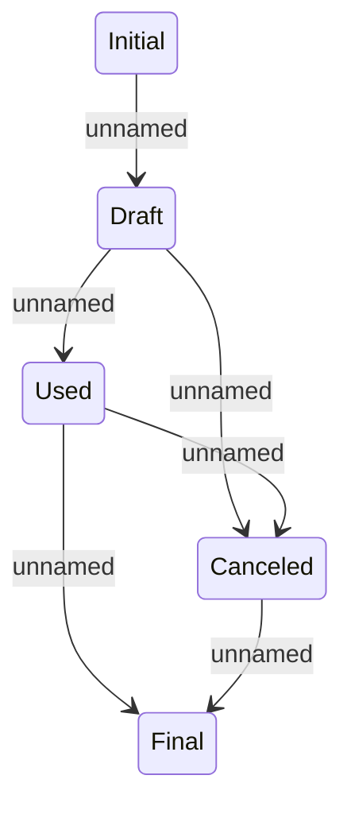

# Commodity status lifecycle

- **Diagram Type**: Statechart
- **Package**: HomerSelect/BSL/Modules/Commodity/Analytical Model/Commodity Data/Commodity status lifecycle
- **Diagram ID**: 136089
- **Elements**: 5
- **Connectors**: 6

