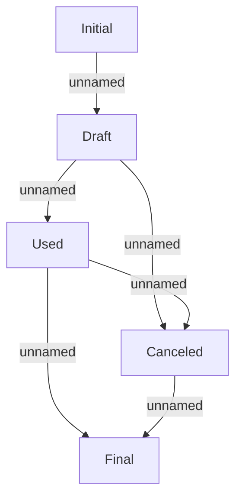

# Commodity status lifecycle

```mermaid
graph TD
    Final["Final"]
    Canceled["Canceled"]
    Used["Used"]
    Draft["Draft"]
    Initial["Initial"]
    Used -->|unnamed| Final
    Canceled -->|unnamed| Final
    Draft -->|unnamed| Canceled
    Used -->|unnamed| Canceled
    Draft -->|unnamed| Used
    Initial -->|unnamed| Draft
```
