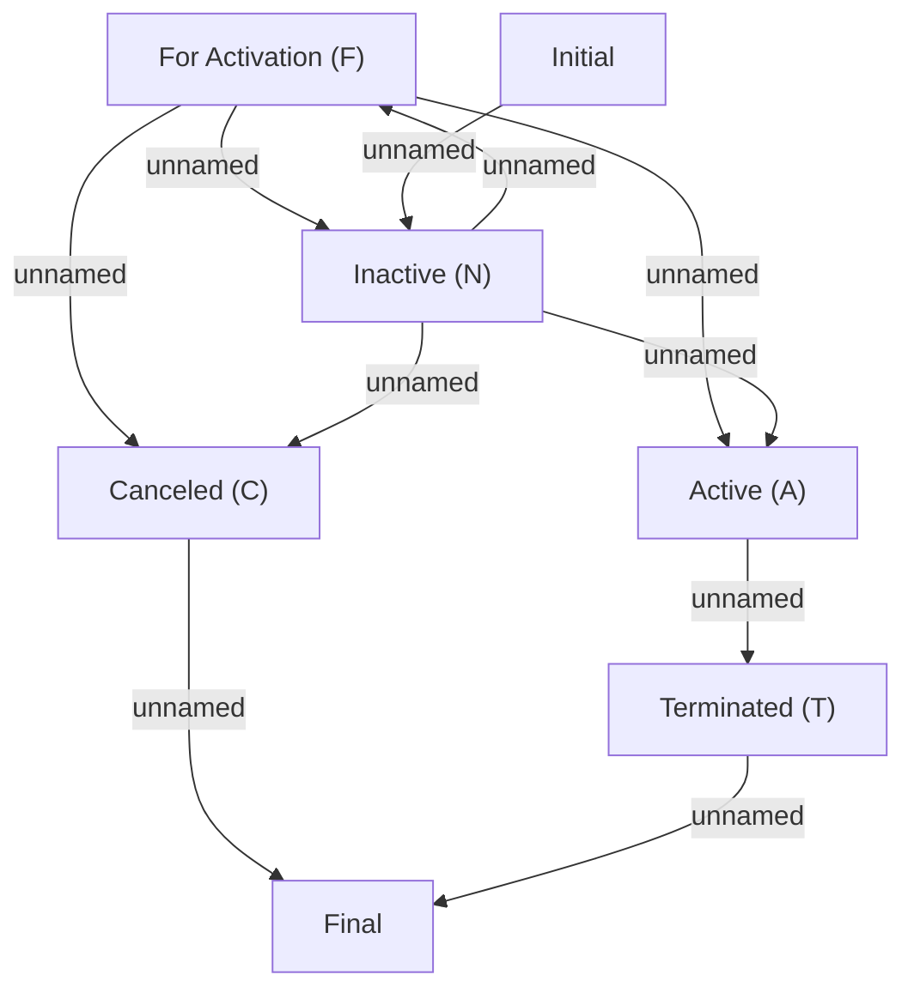

# Version Status

```mermaid
graph TD
    For_Activation_F["For Activation (F)"]
    Canceled_C["Canceled (C)"]
    Terminated_T["Terminated (T)"]
    Active_A["Active (A)"]
    Final["Final"]
    Initial["Initial"]
    Inactive_N["Inactive (N)"]
    For_Activation_F -->|unnamed| Inactive_N
    Initial -->|unnamed| Inactive_N
    Canceled_C -->|unnamed| Final
    Terminated_T -->|unnamed| Final
    For_Activation_F -->|unnamed| Active_A
    Inactive_N -->|unnamed| Active_A
    Active_A -->|unnamed| Terminated_T
    For_Activation_F -->|unnamed| Canceled_C
    Inactive_N -->|unnamed| Canceled_C
    Inactive_N -->|unnamed| For_Activation_F
```
