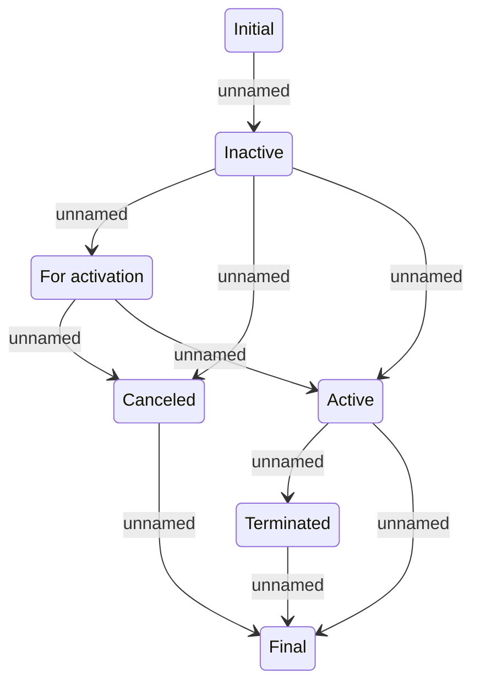

# Versioned entity lifecycle

- **Diagram Type**: Statechart
- **Package**: HomerSelect/BSL/Modules/Product Catalog (PRC)/Analytical Model/COMMON for Product Catalog/Versioned entity/Versioned entity lifecycle
- **Diagram ID**: 161059
- **Elements**: 7
- **Connectors**: 10

