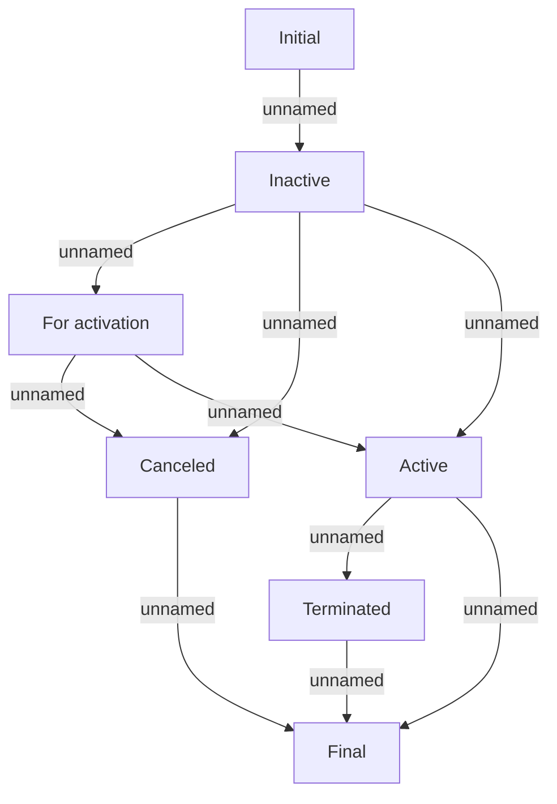

# Versioned entity lifecycle

```mermaid
graph TD
    Terminated["Terminated"]
    For_activation["For activation"]
    Canceled["Canceled"]
    Active["Active"]
    Inactive["Inactive"]
    Final["Final"]
    Initial["Initial"]
    Active -->|unnamed| Terminated
    Inactive -->|unnamed| For_activation
    Inactive -->|unnamed| Canceled
    For_activation -->|unnamed| Canceled
    Inactive -->|unnamed| Active
    For_activation -->|unnamed| Active
    Initial -->|unnamed| Inactive
    Active -->|unnamed| Final
    Canceled -->|unnamed| Final
    Terminated -->|unnamed| Final
```
