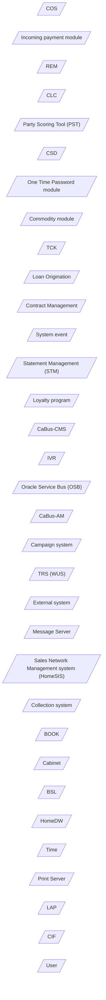

# Actors

- **Diagram Type**: Use Case
- **Package**: HomerSelect/BSL/Actors
- **Diagram ID**: 164607
- **Elements**: 33
- **Connectors**: 0

```mermaid
graph LR
    COS[/"COS"/]
    Incoming_payment_module[/"Incoming payment module"/]
    REM[/"REM"/]
    CLC[/"CLC"/]
    Party_Scoring_Tool_PST[/"Party Scoring Tool (PST)"/]
    CSD[/"CSD"/]
    One_Time_Password_module[/"One Time Password module"/]
    Commodity_module[/"Commodity module"/]
    TCK[/"TCK"/]
    Loan_Origination[/"Loan Origination"/]
    Contract_Management[/"Contract Management"/]
    System_event[/"System event"/]
    Statement_Management_STM[/"Statement Management (STM)"/]
    Loyalty_program[/"Loyalty program"/]
    CaBus_CMS[/"CaBus-CMS"/]
    IVR[/"IVR"/]
    Oracle_Service_Bus_OSB[/"Oracle Service Bus (OSB)"/]
    CaBus_AM[/"CaBus-AM"/]
    Campaign_system[/"Campaign system"/]
    TRS_WUS[/"TRS (WUS)"/]
    External_system[/"External system"/]
    Message_Server[/"Message Server"/]
    Sales_Network_Management_system_HomeSIS[/"Sales Network Management system (HomeSIS)"/]
    Collection_system[/"Collection system"/]
    BOOK[/"BOOK"/]
    Cabinet[/"Cabinet"/]
    BSL[/"BSL"/]
    HomeDW[/"HomeDW"/]
    Time[/"Time"/]
    Print_Server[/"Print Server"/]
    LAP[/"LAP"/]
    CIF[/"CIF"/]
    User[/"User"/]
```
