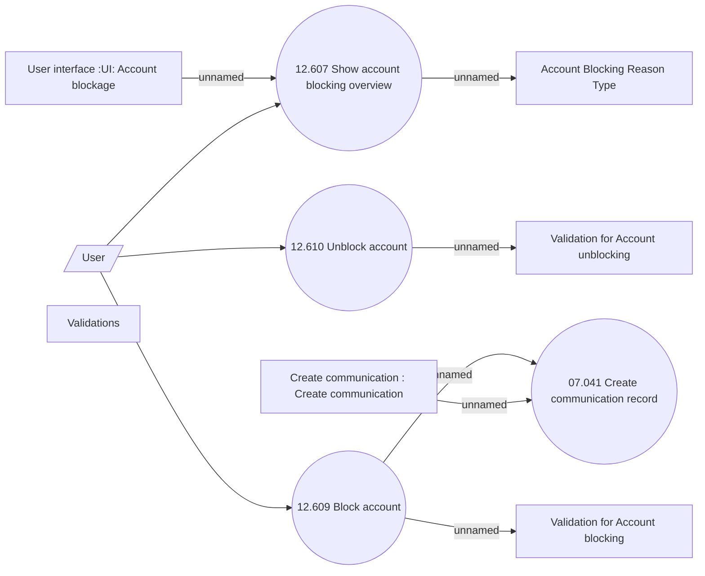

# Account Blockage use case model

- **Diagram Type**: Use Case
- **Package**: HomerSelect/BSL/Analysis Model/Account management/Account blockage/Use Case Model
- **Diagram ID**: 161439
- **Elements**: 11
- **Connectors**: 9

