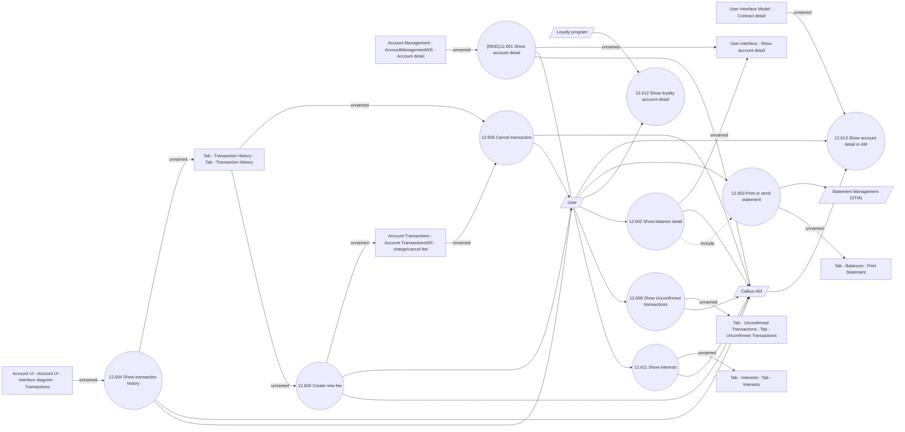

# Account detail

- **Diagram Type**: Use Case
- **Package**: HomerSelect/BSL/Analysis Model/Account management/Account detail/Use case
- **Diagram ID**: 164390
- **Elements**: 24
- **Connectors**: 34

