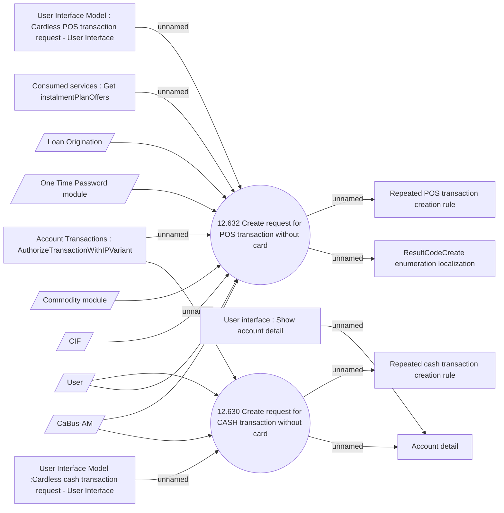

# Cardless transaction request - Use case model

- **Diagram Type**: Use Case
- **Package**: HomerSelect/BSL/Analysis Model/Account management/Cardless transactions support/Use case model
- **Diagram ID**: 154140
- **Elements**: 17
- **Connectors**: 18

