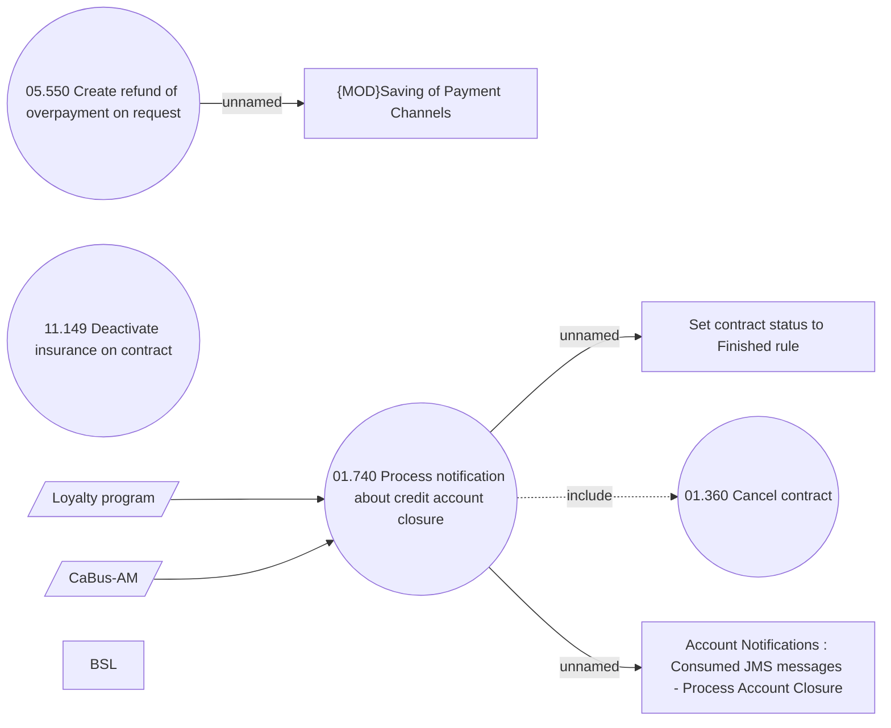

# Processing a notification about credit account closure

- **Diagram Type**: Use Case
- **Package**: HomerSelect/BSL/Analysis Model/Account management/Credit account notification processing/Use Case Model
- **Diagram ID**: 160365
- **Elements**: 10
- **Connectors**: 6

