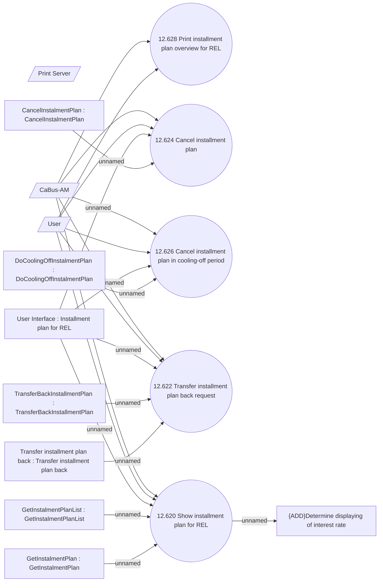

# Installment plan for REL management

- **Diagram Type**: Use Case
- **Package**: HomerSelect/BSL/Analysis Model/Account management/Installment Plan for REL/Use Cases
- **Diagram ID**: 133201
- **Elements**: 16
- **Connectors**: 21

